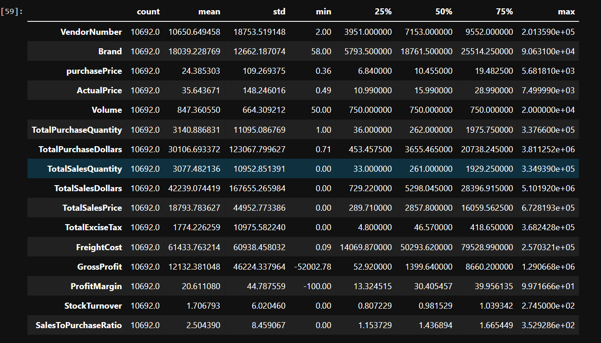
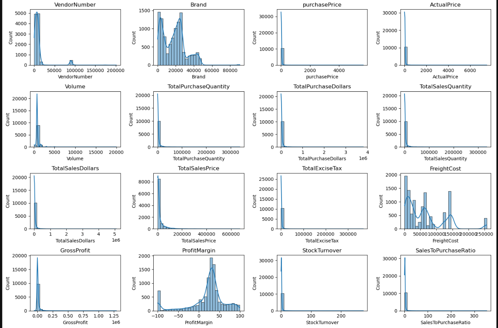
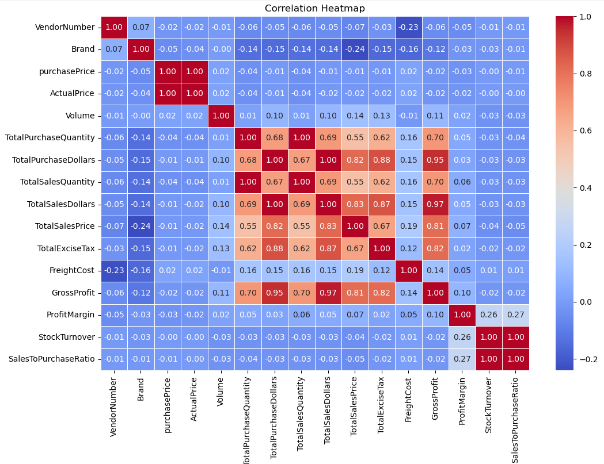
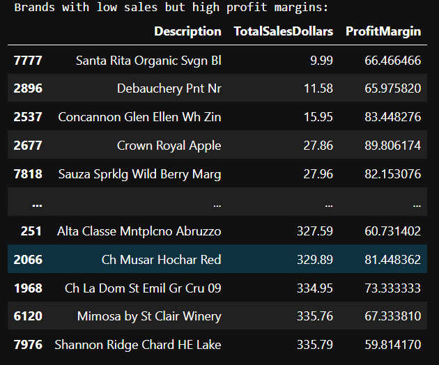
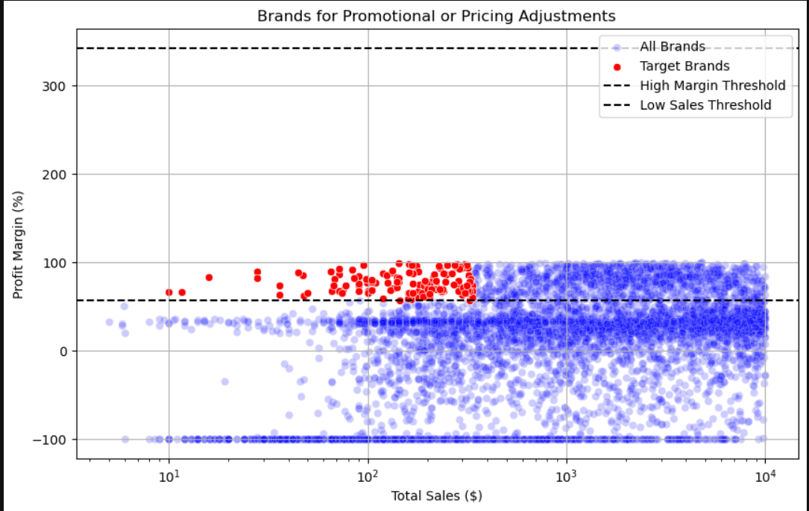
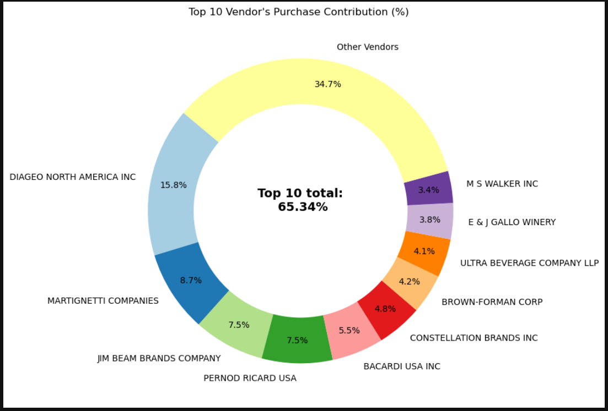
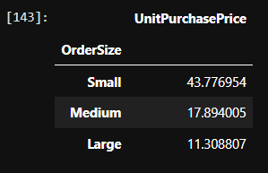
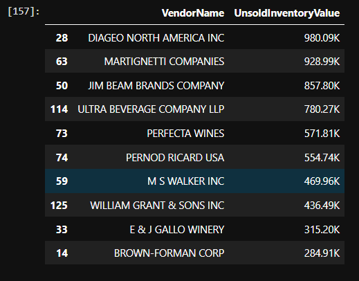
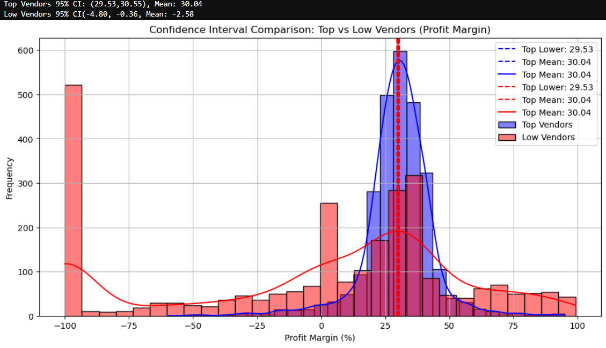

# Exploratory Data Analysis Statistics
## Summary Statistics

### Negative and Zero Values:
- **Gross Profit:** Minimum value is -52,002.78, including losses. Some products or transactions may be selling at a loss due to hogh costs or selling at discounts lower than the purchase price.
- **Profit Margin:** Has a minimum of -infinity, which suggests cases where revenue is zero or even lower than costs.
- **Total Sales Quantity & Sales Dollar:** Minimum values are 0, meaning some products were purchased but never sold. These could be slow- moving or obsolute stock.

### Outliers indicated by high Standard Deviation:
- **Purchase & Actual Prices:** The max values (5,681.81 & 7,499.99) are significantly higher than the mean (24.39 & 35.64), indicating potential premium products.
- **Freight Cost:** Huge variation, from 0.09 to 2,57,032.07, suggests logistics insufficient or bulk shipments.
- **Stock Turnover:** Ranges from 0 to 274.5, implying some products sell extremely fast while others remain in stock indefinetly. Values more than 1 indicates that sold quantity for that product is higher than purchased quantity due to either sales are being fulfilled from older stocks.
 
 

## Data Filtering
To enhance the reliability of the insights, we removed inconsistent data points where:
- Gross Profit <=0 (to exclude all transactions leading to losses).
- Profit Margin <=0 (to ensure analysis focuses on profitable transactions.
- Total Sales Quantity = 0 (to eliminate inventory that was never sold).

- **PurchasePrice has weak correlations with TotalSalesDollar(-0.012) and GrossProfit (-0.016)**, suggesting that price variations do not significantly impact sales revenue or profit.
- **Strong correlation between total purchase quantity and total sales quantity (0.999)**, confirming efficient inventory turnover.
- **Negative correlation between profit margin & total sales price (-0.179)** suggests that as sales price increases, margin decreases, possibly due to competitive pricing pressures.
- **Stock Turnover has weak negative correlations with both GrossProfit (-0.038) and ProfitMargin (-0.0555)**, including that faster turnover does not necessarily result in higher profitability.
 
 

# Research Questions & Handling
## 1. Brands for Promotional or Pricing Adjustments

*198 brands out exibits lower sales but higher profit margins, which could benefit from targeted marketing , promotions, or price optimizations to increase volume without compromising profitability.*
 
 

 
 

## 2. Top Vendors by sales & Purchase Contribution 
*The top 10 vendors contribute 65.34% of total purchases, while the remaining vendors contribute only 34.7%. This over-reliance on a few vendors may introduce risks such as supply chain disruptions, indicating never for diversification.*

## 3. Impact of Bulk Purchasing on Cost Saving
*Vendors buying in large quantities receive as 72% lower unit cost ($11.3 per unit vs higher unit costs in smaller ones.*
  
Bulk pricing statergies encourage larger orders, increasing total sales while maintaining profitability.

## 4. Identifying Vendors with Low Inventory Turnover
*Total Unsold Inventory Capital:$2.71M*

Slow-moving inventory increases storage costs, reduces cash flow efficiency, and affects overall profitability.

Identifying vendors with low inventory turnover enables better stock management, minimizing financial strain.

## 5. Profit Margin Comparison: High vs Low-Performing Vendors
*Top Vendors' Profit Margin (95% CI): (30.74%, 31.61%), Mean: 31.17%*
*Low Vendors' Profit Margin (95% CI): (40.48%, 42.62%), Mean: 41.55%*

Low-performing vendors maintain higher margins but struggle with sales volumes, indicating potential pricing inefficiencies or market reach issues.

**Actionable Insights:**
  - Top-performing vendors: Optimize profitability by adjusting pricing, reducing operational costs, or offering bundles promotions.
  - Low-performing vendors: Improve marketing efforts, optimize pricing statergies, and enhance distribution networks.
  

## 6. Statistical Validation of Profit Margin Differences
### Hypothesis Testing
$H_0$ (Null Hypothesis): There is no significant difference in the mean profit margins of top-performing and low performing vendors.
 

$H_1$ (Alternative Hypothesis): The mean profit margins of top- performing and low performing vendors are significantly different.

**Result:** The null hypothesis is rejected, confirming that the two groups operate under distinctly different profitability models.
 
**Implications:** High-margin vendors may benefit from better pricing statergies, while top-selling vendors could focus on cost efficiency.

# Final Recommendations
- Re-evealuation pricing for low sales, high-margin brands to boost sales volume without sacrificing profitability.
- Diversifying vendor partnership to reduce dependency on a few suppliers and mititgate supply chain risks.
- Leverage bulk purchasing advantages to maintain competitive pricing while optimizing inventory management.
- Optimize slow-moving inventory by adjusting purchase quntaties, launching clearence sales, or revising storage statergies.
- Enhance marketing and distribution statergies for low performing vendors to drive higher sales volume without compromising profit margins.
- By implementing these recommendations, the company can acheive sustainable profitability, mititgate risks, and enhance overall operational efficiency.
